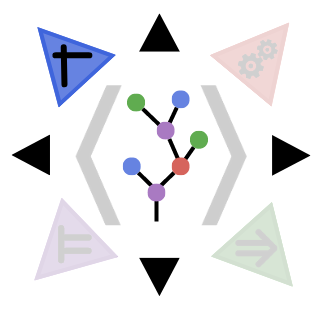

<div align="center"><a href="https://github.com/aclai-lab/Sole.jl"></a></div>

# SoleData.jl – Datasets for data-driven symbolic AI

[](https://aclai-lab.github.io/SoleData.jl)
[](https://aclai-lab.github.io/SoleData.jl/dev)
[](https://cirrus-ci.com/github/aclai-lab/SoleData.jl)
[](https://codecov.io/gh/aclai-lab/SoleData.jl)
<!-- [](https://mybinder.org/v2/gh/aclai-lab/SoleData.jl/HEAD?labpath=pluto-demo.jl) -->

<!-- [](https://aclai-lab.github.io/SoleData.jl/dev) -->

## In a nutshell

*SoleData.jl* defines optimized structures for representing
*logisets*, that is, sets of logical interpretations.
Logisets are the symbolic counterpart to Machine Learning datasets.
<!-- Some optimized data structures, useful when learning models from symbolic learning datasets; -->

## Examples

## Propositional Logic
A tabular dataset (e.g., the [Iris flower dataset](https://en.m.wikipedia.org/wiki/Iris_flower_data_set)) can
be treated as a set of propositional interpretations (or propositional *logiset*), onto which formulas of propositional logic are interpreted.
```julia-repl
julia> using SoleData, MLJBase;

julia> X = PropositionalLogiset(MLJBase.load_iris())
PropositionalLogiset (6.16 KBs)
├ # instances:                  150
├ # features:                   5
└ Table: ...

julia> φ = parseformula(
           "sepal_length > 5.8 ∧ sepal_width < 3.0 ∨ target == \"setosa\"";
           atom_parser = a->Atom(parsecondition(SoleData.ScalarCondition, a; featuretype = SoleData.VariableValue))
       )
SyntaxBranch: (sepal_length > 5.8 ∧ sepal_width < 3.0) ∨ target == setosa

julia> check(φ, X, 10) # Check the formula on a single instance
true

julia> satmask = check(φ, X); # Check the formula on the whole dataset

julia> slicedataset(X, satmask)
PropositionalLogiset (3.66 KBs)
├ # instances:                  79
├ # features:                   5
└ Table: ...


julia> slicedataset(X, (!).(satmask))
PropositionalLogiset (3.38 KBs)
├ # instances:                  71
├ # features:                   5
└ Table: ...

```

## Modal Logic
Non-tabular datasets (e.g., datasets of time-series or images) can be treated as sets of interpretations (*logisets*) of more-than-propositional logics.
For example, a time-series dataset such as [NATOPS](http://www.timeseriesclassification.com/description.php?Dataset=NATOPS) can be interpreted via a modal logic formalism based on intervals and [Allen's (or Interval Algebra) relations](https://en.m.wikipedia.org/wiki/Allen%27s_interval_algebra).
In the following example, we check on each time series in NATOPS the following temporal property, encoded via a modal logical formula:
*"there an interval where V1 is always higher than -0.54, and such that there exists a later interval where either V3 is lower than -0.78, or V5 is higher than -0.84."*

```julia-repl
julia> Xdf, y = SoleData.load_arff_dataset("NATOPS");

julia> X = scalarlogiset(Xdf)
SupportedLogiset with 1 support (343.08 MBs)
├ worldtype:                   SoleLogics.Interval{Int64}
├ featvaltype:                 Float64
├ featuretype:                 SoleData.AbstractUnivariateFeature
├ frametype:                   SoleLogics.FullDimensionalFrame{1, SoleLogics.Interval{Int64}}
├ # instances:                 360
├ usesfullmemo:                true
├[BASE] UniformFullDimensionalLogiset of channel size (51,) (342.91 MBs)
│ ├ size × eltype:              (51, 51, 360, 48) × Float64
│ └ features:                   48 -> SoleData.AbstractUnivariateFeature[max[V1], min[V1], max[V2], min[V2], ..., min[V22], max[V23], min[V23], max[V24], min[V24]]
└[SUPPORT 1] FullMemoset (0 memoized values, 174.42 KBs))

julia> φ = parseformula(
           "⟨G⟩(min[V1] > -0.54 ∧ ⟨L⟩(max[V3] < -0.78 ∨ min[V5] > -0.84))",
           SoleLogics.diamondsandboxes(SoleLogics.IARelations);
           atom_parser = a->Atom(parsecondition(SoleData.ScalarCondition, a; featvaltype = Float64)),
       );
SyntaxBranch: ⟨G⟩(min[V1] > -0.54 ∧ ⟨L⟩(max[V3] < -0.78 ∨ min[V5] > -0.84))

julia> syntaxstring(φ; variable_names_map = names(Xdf)) |> println
⟨G⟩(min[X[Hand tip l]] > -0.54 ∧ ⟨L⟩(max[Z[Hand tip l]] < -0.78 ∨ min[Y[Hand tip r]] > -0.84))

julia> check(φ, X) # Query each instance
360-element Vector{Bool}:
 1
 1
 1
 1
 1
 1
 1
 1
 0
 1
 0
 1
 0
 1
 0
 1
 1
 1
 1
...

```

<!-- "min[X[Hand tip l]] > -0.54 ∧ max[Z[Hand tip l]] < -0.78 ∨ min[Y[Hand tip r]] > -0.84"; -->

## About

The package is developed by the [ACLAI Lab](https://aclai.unife.it/en/) @ University of
Ferrara.

*SoleData.jl* provides the data layer for
[*Sole.jl*](https://github.com/aclai-lab/Sole.jl), an open-source framework for
*symbolic machine learning*.
